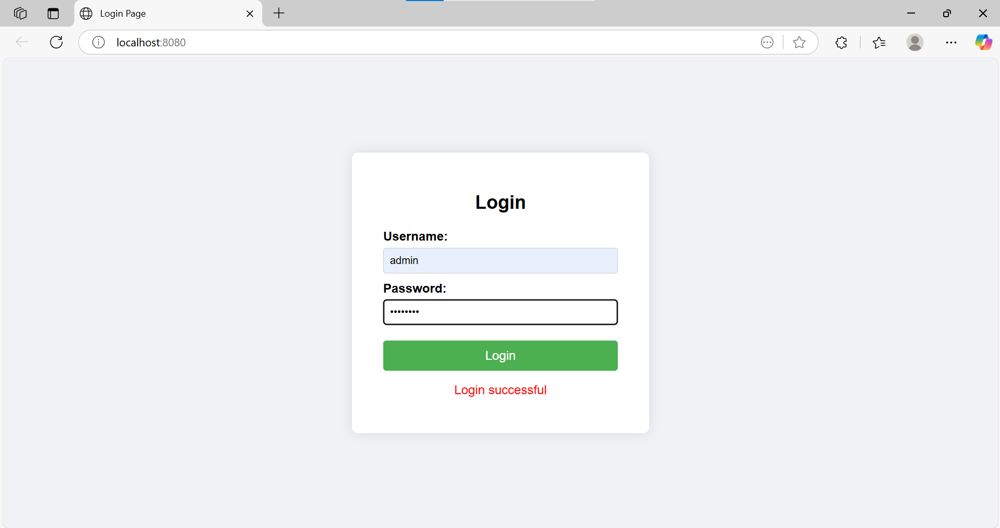
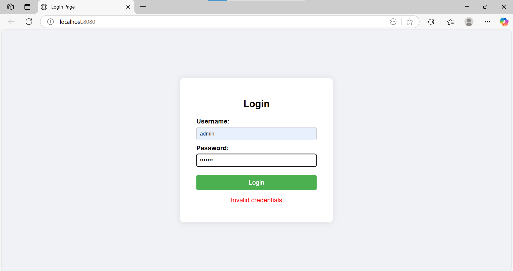

# docker-login-checker

A simple Dockerized web app with frontend and backend login checker.

## 📦 Project Structure

```
docker-login-checker/
├── backend/
│   ├── main.py
│   ├── Dockerfile
│   └── requirements.txt
├── frontend/
│   ├── index.html
│   └── Dockerfile
├── assets/
│   └── output.png
└── docker-compose.yml
```

## 🚀 How to Run

```bash
cd docker-login-checker
docker-compose up --build
```

- Frontend: http://localhost:8080  
- Backend API: http://localhost:5000/login

## 🔐 Default Credentials

- **Username**: `admin`  
- **Password**: `password`

## 🖼️ Output





## 🛠 Tech Stack

- Python FastAPI (Backend)
- HTML/CSS + Nginx (Frontend)
- Docker + Docker Compose"# logincheckerdocker" 
